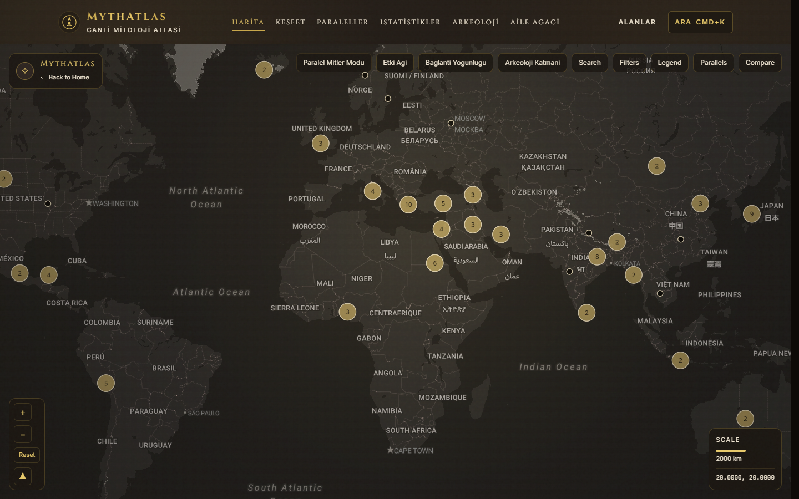
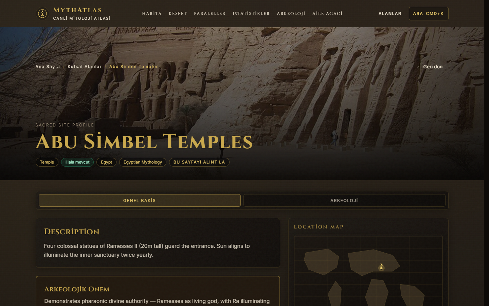

# MythAtlas


MythAtlas is a public mythology atlas that maps myths, deities, and sacred sites across civilizations.

## Highlights
- Interactive world map for mythologies, myths, deities, and sacred sites.
- Rich detail pages with cross-links between entities.
- Open data model powered by static JSON for easy contribution.
- Content integrity gate: every citation, image and heritage claim must be verifiable.
- CI pipeline with lint, type check, data and content integrity checks and a production build.

## Content integrity
An earlier version of the dataset contained generated filler: invented archaeological
references, the same theory books cited on nearly every myth, placeholder images, fabricated
excavation status and unsourced "scholarly consensus" labels. It was cleaned in September 2026:

- Wikipedia/Wikidata matching (`npm run data:wiki-match`) with strict rules; images are kept
  only when they come from the matched article (deities 176/212, sites 90/104).
- UNESCO World Heritage status is kept only when Wikidata confirms it (70 confirmed, 4 dropped).
- Citations went from 1,826 to 274; template references and dead links were removed.
- Parallel-myth similarity is the Jaccard overlap of the two myths' motif sets, nothing more.
- `npm run qa:content` fails the build if unverifiable content returns
  (the pre-cleanup data produces 5,483 violations).

## Vision
- Build a visually rich atlas for comparative mythology.
- Keep data open and contribution-friendly through static JSON files.
- Provide fast, accessible exploration on map, detail, and analytics surfaces.

## Screenshots



## Tech Stack
- Next.js App Router (TypeScript)
- Tailwind CSS + Framer Motion
- MapLibre GL (map)
- Recharts + D3 force (visual analytics)
- Static JSON dataset (`src/data`) and read-only public data endpoints (`public/data`)

## Local Setup
1. Install dependencies:
   ```bash
   npm install
   ```
2. Start development server:
   ```bash
   npm run dev
   ```
3. Build for production:
   ```bash
   npm run build
   npm run start
   ```

## Quality Checks
- Run linting:
  ```bash
  npm run lint
  ```
- Run data integrity audit:
  ```bash
  npm run qa:data-integrity
  ```
- Run content integrity check (and verify `public/data` is in sync):
  ```bash
  npm run qa:content
  ```
- Rebuild cleaned data and `public/data`:
  ```bash
  npm run data:clean
  ```
- Run release gate (lint + audits + build):
  ```bash
  npm run qa:release
  ```

## Project Structure
- `src/app`: App Router pages and route handlers.
- `src/components`: Reusable UI and map components.
- `src/data`: Canonical source datasets.
- `public/data`: Client-facing mirrored datasets and geojson assets.
- `data/`: Documentation for schemas and contribution workflow.
- `qa/`: Audit scripts and QA automation.

## Data Contribution Guide
- Add or edit JSON records in `src/data`.
- Keep ids stable and kebab-case.
- Validate against documented schema before opening a PR.
- See full contributor workflow in [data/CONTRIBUTING.md](./data/CONTRIBUTING.md).

## Contributing
- Read [CONTRIBUTING.md](./CONTRIBUTING.md) for branching, commit, and PR expectations.
- For data-specific additions, follow [data/CONTRIBUTING.md](./data/CONTRIBUTING.md).

## JSON Schemas
- Mythologies: [data/SCHEMA.md#mythology](./data/SCHEMA.md#mythology)
- Myths: [data/SCHEMA.md#myth](./data/SCHEMA.md#myth)
- Deities: [data/SCHEMA.md#deity](./data/SCHEMA.md#deity)
- Sacred Sites: [data/SCHEMA.md#sacred-site](./data/SCHEMA.md#sacred-site)

## Security
If you discover a security issue, report it privately via the process in [SECURITY.md](./SECURITY.md).

## License
MIT. See [LICENSE](./LICENSE).
